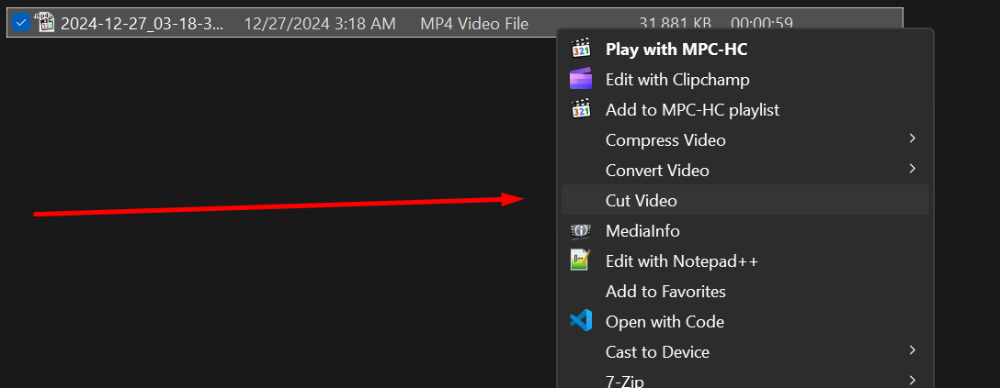
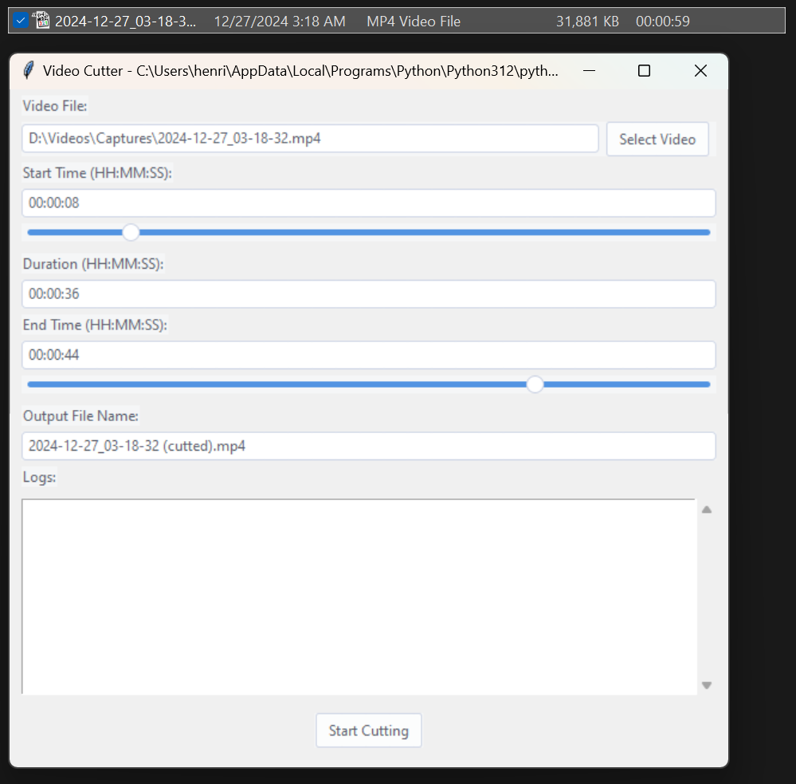

# Video Cutter with Context Menu Integration

<!--  -->

Video Cutter is a user-friendly Python application that allows you to effortlessly cut and trim your videos using a simple graphical interface. Whether you need to extract specific segments or shorten your videos, Video Cutter provides an intuitive solution for all your video editing needs.

Cut videos directly from the context menu:



Simple and direct window for cutting the video and following logs:



## **Features**

- **Easy Video Selection**: Right click or browse and select video files in various formats such as MP4 and AVI.
- **Precise Cutting**: Specify exact start and end times to cut your videos with precision.
- **Real-Time Feedback**: View logs and progress updates directly within the application.
- **Custom Output Naming**: Define your own output filenames or use the default naming convention.
- **Themed Interface**: Enjoy a modern and customizable UI with support for different themes.

## **Prerequisites**

- **Python 3.6 or higher**: Ensure Python is installed and added to your system `PATH`.
- **`pip` Package Manager**: Comes with Python installations.
- **`ffmpeg`**: Download and install from [ffmpeg.org](https://ffmpeg.org/), and add it to your system `PATH`.

## **Installation**

1. **Clone the Repository:**

   ```bash
   git clone https://github.com/tornellihenrique/video-cutter.git
   ```

2. **Navigate to the Project Directory:**

   ```bash
   cd video-cutter
   ```

3. **Install Dependencies:**

   ```bash
   pip install -r requirements.txt
   ```

   **Note**: If you encounter permissions issues, you may need to run the command as an administrator or use a virtual environment.

4. **Install `ffmpeg`:**

   - Download from [ffmpeg.org](https://ffmpeg.org/download.html).
   - Add the `ffmpeg/bin` folder to your system `PATH`.

5. **Set Up Context Menu Integration:**

   - Right-click on `setup_registry.bat` and select **Run as administrator**.
   - Confirm any prompts to allow the script to modify the registry.

## **Usage**

1. **Right-click** any video in Windows Explorer.

2. Select **"Cut Video"** from the context menu.

3. The GUI will appear with the video and save location pre-filled.

4. **Adjust** the parameters as needed.
   - **Select Video**: Click on the "Select Video" button to choose another video file.
   - **Set Start and End Times**: Enter the desired start and end times in `HH:MM:SS` format or use the sliders for adjustment.
   - **Specify Duration**: Optionally, set the duration for the cut segment.
   - **Output Filename**: Define the name for the output video file.

6. Click **"Start Cutting"** and monitor progress in the logs.

7. Once complete, the video file will be saved in the same folder from input video.

## **Project Structure**

```
youtube-downloader/
│
├── cut_video.pyw             # Main application script
├── cut_video_icon.ico        # Icon for context menu
├── setup_registry.bat        # Batch script to set up registry entries
├── remove_registry.bat       # Batch script to remove registry entries
├── requirements.txt          # Python dependencies
├── README.md                 # Project documentation
└── LICENSE                   # License file
```

## **Contributing**

Contributions are welcome! Please open an issue or submit a pull request for any improvements.

## **License**

This project is licensed under the MIT License - see the [LICENSE](LICENSE) file for details.

## **Acknowledgments**

- [ffmpeg](https://ffmpeg.org/) - For processing video and audio streams.
- [ttkthemes](https://github.com/RedFantom/ttkthemes) - For theming the GUI.